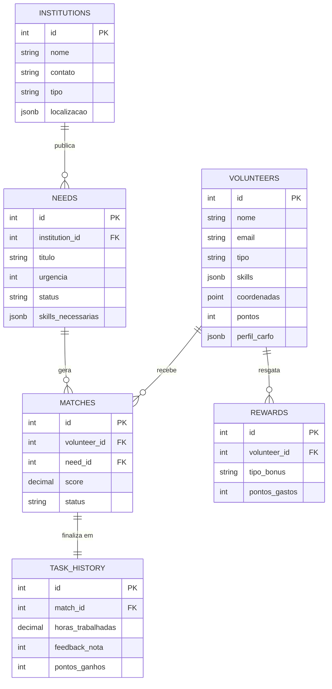

## 🏛️ Estrutura do Banco de Dados - Projeto Voluntários
------------------------------
## 1. Tabela: volunteers (Voluntários)

| Campo | Tipo | Descrição |
|---|---|---|
| id | Serial (PK) | Identificador único |
| nome | Varchar | Nome completo |
| email | Varchar (Unique) | E-mail de login/contato |
| tipo | Enum | permanente ou freelancer |
| skills | JSONB | Lista de habilidades (ex: ["cozinha", "ti"]) |
| cidade | Varchar | Cidade de residência |
| coordenadas | Point/JSONB | Latitude e Longitude |
| disponibilidade | JSONB | Dias e horários disponíveis |
| pontos | Integer | Gamificação (inicia em 0) |
| aberto_revezamento | Boolean | Se aceita escala de revezamento |
| perfil_carfo | JSONB | Dados CARFO (nulo para freelancers) |

## 2. Tabela: institutions (Instituições)

| Campo | Tipo | Descrição |
|---|---|---|
| id | Serial (PK) | Identificador único |
| nome | Varchar | Nome da ONG/Entidade |
| contato | Varchar | Telefone ou e-mail institucional |
| tipo | Enum | ONG, prefeitura, igreja, etc. |
| localizacao | JSONB | Endereço completo e coordenadas |

## 3. Tabela: needs (Ofertas/Demandas)

| Campo | Tipo | Descrição |
|---|---|---|
| id | Serial (PK) | Identificador único |
| institution_id | Int (FK) | Relacionamento com institutions |
| titulo | Varchar | Título da vaga/necessidade |
| descricao | Text | Detalhamento da tarefa |
| skills_necessarias | JSONB | Habilidades exigidas para a vaga |
| urgencia | Integer | Escala de 1 a 5 |
| data_inicio | Timestamp | Quando a tarefa começa |
| status | Enum | aberta, em_andamento, concluída |

------------------------------
## 4. Tabela: matches (O Pareador IA)

| Campo | Tipo | Descrição |
|---|---|---|
| id | Serial (PK) | Identificador único |
| volunteer_id | Int (FK) | Relacionamento com volunteers |
| need_id | Int (FK) | Relacionamento com needs |
| score | Decimal | Pontuação de afinidade (0-100) |
| status | Enum | sugerido, aceito, recusado, concluído |
| criado_em | Timestamp | Data da recomendação da IA |

## 5. Tabela: task_history (Retenção e Feedback)

| Campo | Tipo | Descrição |
|---|---|---|
| id | Serial (PK) | Identificador único |
| match_id | Int (FK) | Relacionamento com matches |
| horas_trabalhadas | Decimal | Tempo dedicado |
| feedback_nota | Integer | Avaliação da instituição (1-5) |
| pontos_ganhos | Integer | Pontos creditados ao voluntário |

## 6. Tabela: rewards (Gamificação/Resgates)

| Campo | Tipo | Descrição |
|---|---|---|
| id | Serial (PK) | Identificador único |
| volunteer_id | Int (FK) | Relacionamento com volunteers |
| tipo_bonus | Enum | lazer, manutenção, curso |
| pontos_gastos | Integer | Custo do resgate |
| data_resgate | Timestamp | Quando foi solicitado |

------------------------------

diagrama de Entidade-Relacionamento (ER) utilizando a sintaxe Mermaid:

------------------------------

## Considerações Finais
- A estrutura do banco de dados é projetada para ser flexível e escalável, permitindo a adição de novas funcionalidades no futuro.
- O uso de JSONB para campos como skills e localização permite armazenar dados complexos sem a necessidade de tabelas adicionais, facilitando consultas e atualizações.
- A gamificação é integrada desde o início, incentivando a participação contínua dos voluntários e promovendo um ambiente de engajamento positivo.
- A tabela de matches é central para o funcionamento do sistema, permitindo que a IA faça recomendações personalizadas com base nas habilidades e preferências dos voluntários, bem como nas necessidades das instituições.
- A tabela de task_history é crucial para a retenção de dados e feedback, permitindo que o sistema aprenda e melhore suas recomendações ao longo do tempo, além de fornecer insights valiosos para as instituições sobre o desempenho dos voluntários.